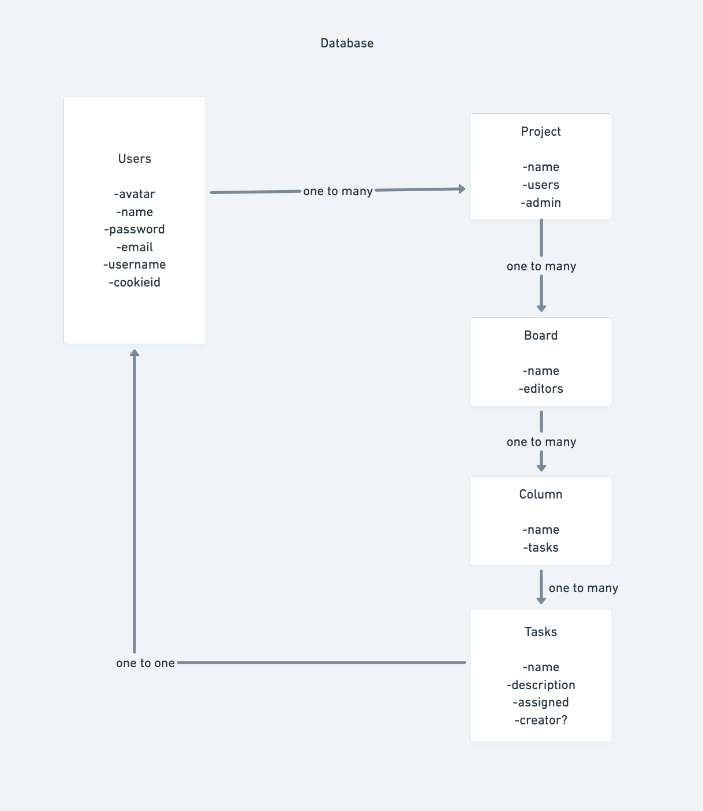

# Trollo

## Introduction

Trollo is a task manager that bears absolutely no resemblence to [Trello](http://trello.com), another popular task management tool.

## Creating an Account

When you visit Trollo for the first time you will be prompted to log in with a existing account or create a new one.

Clicking the sign up button will display a form to input the new accounts information. All accounts must have an email address and a password. Optionally you can also provide an avatar URL for an image that will displayed alongside your name when using the app.

## Logging In

Once you have created an account you can log in with your users details. Trollo uses a cookie based authentication system so you should only have to do this once per device, after which you will remain logged into the app until you choose to log out.

## Organization

Trollo is organized hierarchically into Projects > Boards > Columns > Tasks.

A Task represents an item that needs to be acted on. E.g. "Take the bins out".

A Column is a collection of tasks grouped under a common heading. E.g. You might have a column that contains all the tasks you need to complete on a certain day or you could have another column that conains all the tasks related to one aspect of your job.

A Board is a collection of columns that are related to eachother. E.g. You could have two seperate Trollo boards for tasks related to your job and tasks in your personal life.

A Project is a collection of Boards and is the highest level of organization available in Trollo. E.g. You may have one project for each product team in your company. A User must be invited before they can view and contribute to a project, this way you can control who has access to the information contained in each project.

## The Dashboard

Once logged in your dashboard will be displayed. From here you can see all of the projects that your account is part of.

Clicking the "+" button will create a new project.

Clicking the name of a project will display all the boards that it contains. From here you can click on a board to open it up and view its columns and tasks.

You can create a new column inside a board by clicking the "Add Column" button at the bottom of the column. This will open up a window where you can give the task a name and (optionally) assign it to a user.

Assigning a task to a user marks it as their responsibility. Multiple users can be assigned to the same task.

## The Technology

Trello was built using React on the fronted and a REST api built with Node.js/Express serving from a SQLite database on the backend.

Below is UML diagram of our databse structure.
